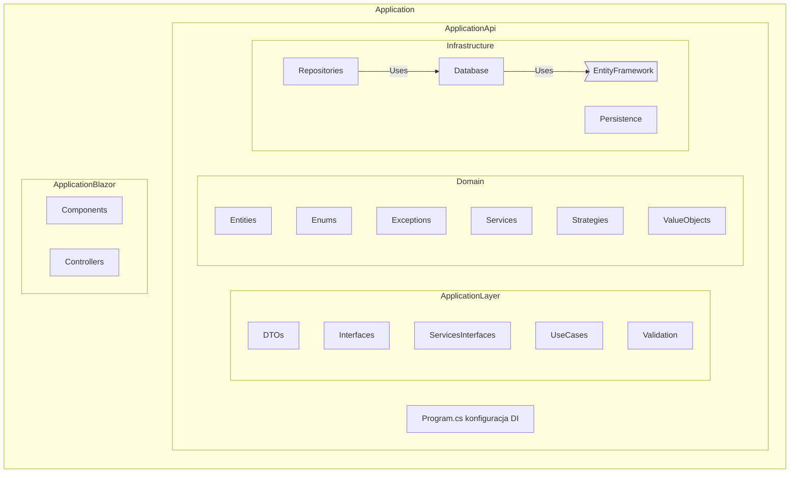

```mermaid
flowchart LR

    subgraph Application
        subgraph ApplicationApi
            Program[Program.cs konfiguracja DI]
            subgraph ApplicationLayer
                DTOs
                Interfaces
                ServicesInterfaces
                UseCases
                Validation
            end
            subgraph Domain
                Entities
                Enums
                Exceptions
                Services
                Strategies
                ValueObjects
            end
            subgraph Infrastructure
                Database -->|Uses| EntityFramework
                Persistence
                Repositories -->|Uses| Database
                EntityFramework>EntityFramework]
            end
        end

        subgraph ApplicationBlazor
            Program[Program.cs konfiguracja DI]
            Components
            Controllers
        end
    end
```
